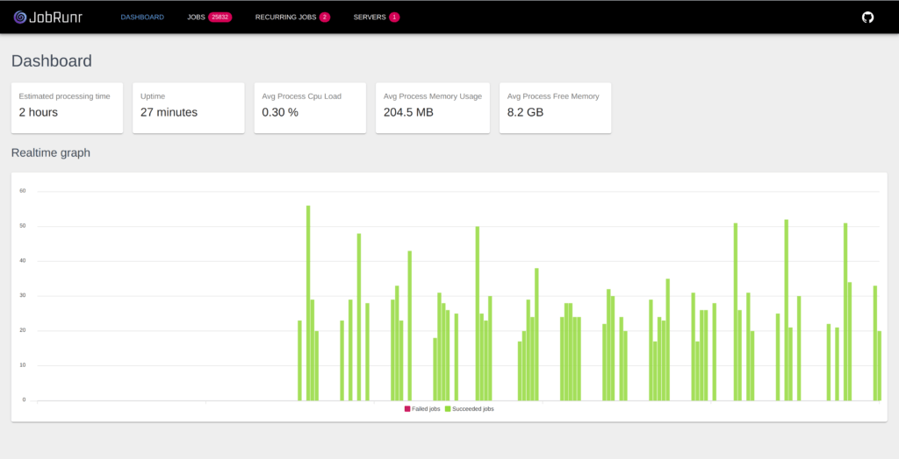

Foundation intègre la librairie [JobRunr](https://www.jobrunr.io/) dont la spécialité est la gestion distribuée de tâches. 
JobRunr requiert une base de données pour fonctionner. Si votre projet utilise une base de données, l'intégration de cette 
fonctionnalité vous simplifiera de façon importante la gestion des opérations récurrentes et opérations en arrière plan.

## Principes de base

L'interface `dev.soffa.foundation.scheduling.Scheduler` est le point d'entrée de toute les opérations planifiées.
L'intégration avec `JobRunr` n'est qu'une implémentation de cette interface. D'autres implémentations sont disponibles, notamment
celle pour vos tests d'intégration.

## Opérations en arrière-plan

La méthode `scheduler.enqueue` vous permet de créer une tâche planifiée à exécution unique.

```java
scheduler.enqueue(
    // identifiant unique de la tâche planifiée pour éviter les doublons
    "accounts.admin.process",  
    // Operation à exécuter
    HandleNewAccount.class,
    // Paramtère attendu par l'opération 
    accountId, 
    // Contexte d'exécution
    context
)
```

## Opérations récurrentes (manuel)

La méthode `scheduler.scheduleRecurrently` vous permet de créer une tâche récurrente

```java
scheduler.scheduleRecurrently(
    // identifiant unique de la tâche planifiée pour éviter les doublons
    "cronId",  
    // Expression CRON pouré définir la récurrence (ex: chaque 10 secondes)
    "*/10 * * * * *", 
    // ServiceWorker à invoquer
    worker,
)
```

L'objet `worker` est une instance de l'interface `dev.soffa.foundation.scheduling.ServiceWorker`

Exemple:

```java
public class SimpleJobHandler implements ServiceWorker {

    private static final AtomicInteger COUNTER = new AtomicInteger(0);

    public static int getCount() {
        return COUNTER.get();
    }

    @Override
    public void tick() {
        COUNTER.incrementAndGet();
    }
}
```


## Opérations récurrentes (annotation)

Invoquer `scheduler.scheduleRecurrently()` n'est pas toujours nécessaire.  Au démarrage, Foundation effectue une rechercher sur les 
composants injectables ayant l'annotation `@dev.soffa.foundation.annotation.Cron` pour les inscrire dans la planification récurrente.

```java

import dev.soffa.foundation.annotation.Cron;
import dev.soffa.foundation.scheduling.ServiceWorker;
import javax.inject.Named;

@Named
@Cron(Cron.EVERY_5_SECONDS)
public class SimpleJobHandler implements ServiceWorker {

    @Override
    public void tick() {
    }
}

```