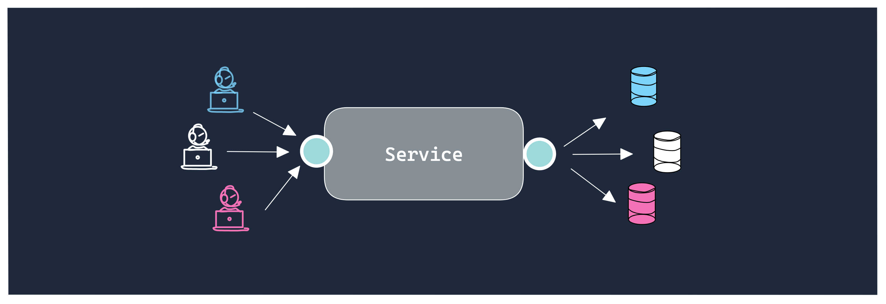

## Multitenancy

L'api de persistence Foundation a été avant tout penser pour simplifier l'accès à plusieurs bases de données.


### Liste fixe de tenants 

Dans certains usecases, votre service se connecte à une liste prédéfinie de bases de données.
Le descripteur yaml vous permet de définir cette liste de façon simple et intuitive.

```yaml application-default.yml
app.db.datasources:
  default:
    url: pg://postgres:postgres@localhost/general
    migration: general
  customer1:
    url: pg://postgres:postgres@localhost/customer-1
    migration: customers
  customer2:
    url: pg://postgres:postgres@localhost/customer-2
    migration: customers  

```


### Liste dynamique de tenants

En développant une solution de type SaaS, il est plus fréquent de se retrouver avec une liste de tenants dynamiques.
Le fichier de configuration doit donc être adapté comme suit :

```yaml application-default.yml
app.db.datasources:
  default:
    url: pg://postgres:postgres@localhost/general
    migration: general
  __TENANT__:
    url: pg://postgres:postgres@localhost/customers?schema=__TENANT__
    migration: customers
```        

L'exemple ci-dessus utilise les schémas postgresql pour séparer les données de chaque client. Vous pouvez tout aussi bien
utiliser une base de données pour chaque client comme suit:

```yaml application-default.yml
app.db.datasources:
  default: 
    url: pg://postgres:postgres@localhost/general
    migration: general
  __TENANT__:
    url: pg://postgres:postgres@localhost/__TENANT__
    migration: customers
```    

Le mot clé `__TENANT__` sera remplacé par le **tenant actif**.

**Retourer la liste dynamique de tenants**

L'interfae `TenantsLoader` doit ensuite être implémentée pour créer automatiquement les datasources correspondantes.

```java
@Named
public class MyTenantLoader implements TenantsLoader {

    public Set<String> getTenantList() {
        /* Récupérer et retouner la liste de tenants dynamique */
    }

}
```

### Activation des tenants

Une fois la configuration finalisée, votre service a besoin de basculer d'un tenant à l'autre.


- `dev.soffa.foundation.multitenancy.TenantHolder.set()`
- `dev.soffa.foundation.multitenancy.TenantHolder.use()`
- `dev.soffa.foundation.multitenancy.TenantHolder.useDefault()`

```java
@Inject
private  UserRepository users;

// Retourne la liste des utilisateurs pour la datasource/tenant 'default)
users.count(); 

TenantHolder.set("customer1");
// Tous les requêtes exécutée dans le même Thread après cette ligne
// on redirigées vers le tenant 'customer1'
// Retourne la liste des utilisateurs pour la datasource/tenant 'customer1'
users.count(); 

TenantHolder.set("customer2");
// Retourne la liste des utilisateurs pour la datasource/tenant 'customer2'
users.count(); 
TenantHolder.use("customer1", () -> {
    // Exécuter temporairement un traiement dans les données du custome1
});
TenantHolder.useDefault(() -> {
    // Exécuter temporairement un traiement dans les données de la datasource par défaut
});
users.count();  // Données du customer2
```
